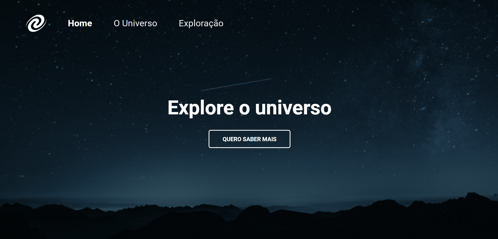

# SPA Universe



Bem-vindo ao **SPA Universe** - uma Single Page Application (SPA) moderna construída para explorar e demonstrar conceitos de roteamento no lado do cliente e integração com o `lite-server`.

## 🌌 Sobre o Projeto

Este projeto foi desenvolvido com o objetivo de testar e demonstrar conceitos avançados de SPA, utilizando uma abordagem personalizada para o roteamento no lado do cliente. Ele oferece uma experiência de usuário fluida, carregando conteúdo dinamicamente sem a necessidade de recarregar a página inteira.

## 🚀 Principais Características

- **Roteamento Personalizado**: Implementamos uma classe de roteador personalizada que gerencia a navegação entre diferentes páginas sem a necessidade de recarregar a página.
- **Integração com lite-server**: Usamos o `lite-server` para servir nosso conteúdo, proporcionando um ambiente de desenvolvimento rápido e eficiente.
- **Design Responsivo**: A aplicação é totalmente responsiva, proporcionando uma ótima experiência em dispositivos móveis e desktop.

## 🛠️ Tecnologias Utilizadas

- JavaScript (ES6+)
- CSS3
- HTML5
- lite-server

## 🔧 Instalação e Uso

1. Clone este repositório:

```
git clone https://github.com/rafaelandrade/spa-universe.git
```

2. Navegue até o diretório do projeto:

```
cd spa-universe
```

3. Instale as dependências:

```
npm install
```

4. Inicie o servidor:

```
npm start
```

Agora, a aplicação estará rodando no `http://localhost:3000`.

## 🙋‍♂️ Contribuições

Sinta-se à vontade para abrir uma Issue ou enviar um Pull Request. Todas as contribuições são bem-vindas!

## 📄 Licença

[](https://opensource.org/licenses/MIT)

Este projeto está sob a licença MIT. Veja o arquivo [LICENSE](LICENSE) para mais detalhes.

---

👤 **Rafael Andrade**

- Portfólio: [rafaelandrade.dev](https://rafaelandrade.dev)
- Email: [oi@rafaelandrade.dev](mailto:oi@rafaelandrade.dev)
